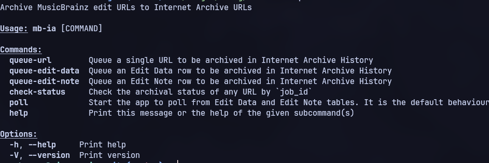

### Architecture

This is a high level overview of the folder structure of the project.

```
.
├── Cargo.toml
├── config/ (config contains .yaml files that provides configs and various numeric values required to run the project.)
├── docker/ (contains Dockerfiles and docker compose configs)
├── grafana ( contains dashboard configs and prometheus datasources config)
│   ├── dashboards/
│   └── datasources/
├── prometheus.yaml (define prometheus metric collection related configs here)
├── scripts/ (various scripts that helps in populating tables, schema and test data)
│   └── sql/
├── src
│   ├── app/ (main application where we start poller and archival tasks) 
│   ├── archival/  (deals with network requests to archive URLs, check status of archival, and cleanup of completed values) 
│   │   └── tests/ (contains unit tests for archival service)
│   ├── cli/ (cli options are set here, along with the utils)
│   ├── configuration/ (parsing logic for .yaml configs belongs here)
│   ├── lib.rs (treats the app as a library)
│   ├── main.rs (entry point to the app)
│   ├── metrics/ (module contains metrics, and metrics collection methods for the app)
│   ├── poller/ (polling logic resides here)
│   │   └── tests/ (unit tests for poller module)
│   └── structs/
└── tests (contains Integration tests)
    ├── archival/
    ├── fixtures/
    ├── main.rs 
    └── poller/
```


## Current Implementation (WIP)

We want to get URLs from `edit_data` and `edit_note` tables, and archive them in Internet Archive history.
The app provides multiple command line functionalities to archive URLs from `edit_data` and `edit_note` tables:


We create a `external_url_archiver` schema, under which we create the required table, functions, trigger to make the service work.

Following are the long-running tasks:

1. `poller task`
   - Create a `Poller` implementation which:
     - Gets the latest `edit_note` id `edit_data` edit from `internet_archive_urls` table. We start polling the `edit_note` and `edit_data` from these ids.
   - Poll `edit_note` and `edit_data` table for URLs
   - Transformations to required format
   - Save output to `internet_archive_urls` table
2. `archival task`
   - Has 2 parts:
     1. `notifer`
         - Creates a `Notifier` implementation which:
           - Fetches the last unarchived URL row from `internet_archive_urls` table, and start notifying from this row id.
           - Initialises a postgres function `notify_archive_urls`, which takes the `url_id` integer value, and sends the corresponding `internet_archive_urls` row through the channel called `archive_urls`.
         - This periodically run in order to archive URLs from `internet_archive_urls`.
     2. `listener`
         - Listens to the `archive_urls` channel, and makes the necessary Wayback Machine API request (The API calls are still to be made).
         - The listener task is delayed for currently 5 seconds, so that no matter how many URLs are passed to the channel, it only receives 1 URL per 5 seconds, in order to work under IA rate limits.
3. `retry/cleanup task`
   - Runs every 24 hours, and does the following:
     1. If the `status` of the URL archival is `success`, and the URL is present in the table for more than 24 hours, cleans it.
     2. In case the URL's status is still null which means pending, it resends the URL to `archive_urls` channel from `notify_archive_urls` function, so that it can be re-archived.
